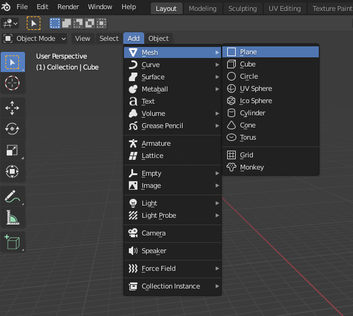
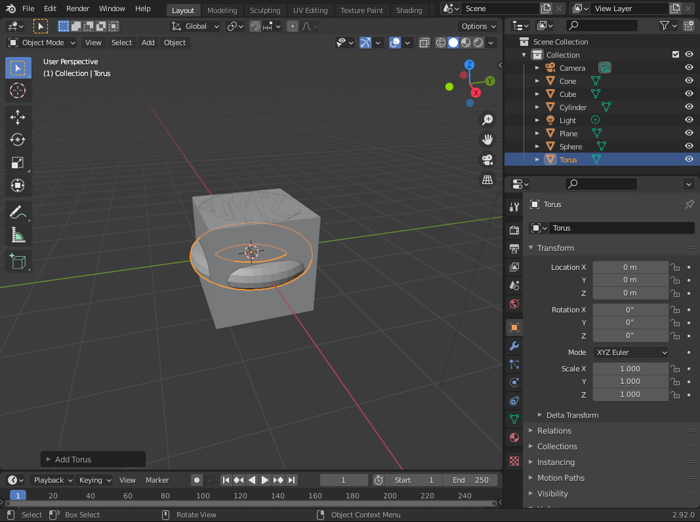
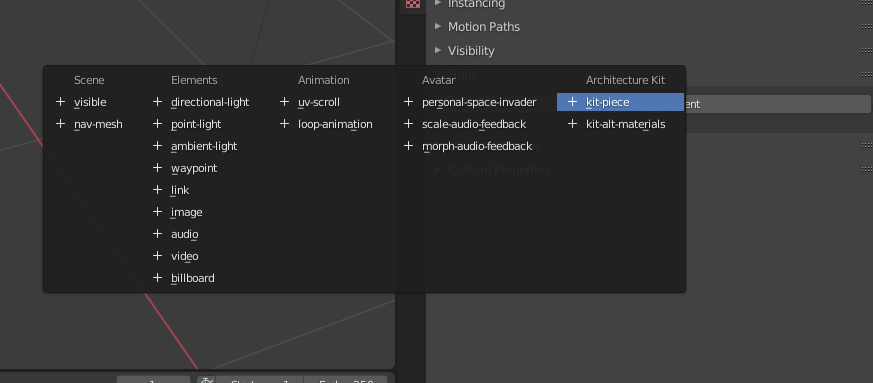
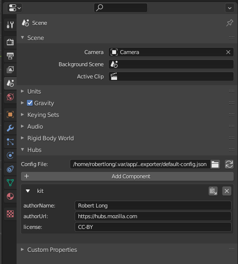
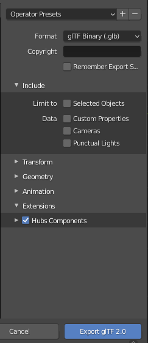

# Creating Kits

Kits, like the [Architecture Kit](https://github.com/MozillaReality/hubs-architecture-kit) and the [Rock Kit](https://github.com/MozillaReality/hubs-rock-kit) are special asset sources in Spoke. They are intended to reduce material usage and increase our ability to combine objects before exporting. In this guide we'll go over how to create a kit using Blender, the Spoke Kit Packager, and write the code to add it to Spoke.

To start out, we'll need to grab [Blender](https://www.blender.org/) and install the [Hubs Blender Exporter](https://github.com/MozillaReality/hubs-blender-exporter). Follow the guide in the Hubs Blender Exporter repository to install the addon.

Once you've got the addon set up, let's create a new Blender project. We won't be going into the details of how to model with Blender and we'll only be working with primitive shapes.

Your scene should already have the default cube in it. Keep it and add a Plane, UV Sphere, Cylinder, Cone, and Torus to your scene.

These shapes can be found in the `Add > Mesh` Menu:



Once you've added all of the shapes to your scene, it should look something like this:


All of your shapes should be centered at the origin and overlapping.

Next we're going to add the `kit-piece` component to each of the shapes. In the Object Properties pane, expand the Hubs section and click "Add Component" then select the `kit-piece` component.



By default the object will have an id and name set to the name of the object. This is fine since all of our shapes have unique names.

Next go to the Scene tab in the properties panel and add the `kit` component to the scene. In this component you can set your own attribution info.



Now we're going to export the kit by going to `File > Export > glTF 2.0 (.glb/.gltf)`

Name the file `ShapeKit.glb` and pick a path that you'll remember. Make sure the format is set to `glTF Binary (.glb)`. The rest of the settings can be left to the default settings:



We're done with Blender for now. Remember to save your project before continuing.

Start up Spoke locally with `yarn start` and navigate to [https://localhost:9090/kits/package](https://localhost:9090/kits/package).

Click the "Upload Kit (.glb)" button and find the kit file you exported from Blender. The packager will generate kit piece metadata and thumbnails and give you a zip file to download.

Now we need to host the kit somewhere. For now, let's just use a simple local webserver.

I'm going to be using `npx serve`. To do this I'll extract the zip folder to a spot on my computer. Then I'll navigate to that directory and run `npx serve -C`. The `-C` parameter is to enable CORS headers so that we can read content across the other origin (Port 5000).

My kit files are now hosted locally at `http://localhost:5000`. Depending on what local server you use, the url may be different.

Now we're going to add the kit to Spoke. We'll do this by creating a new asset source. Open up your editor and create a file, `ShapeKitSource.js` in `/src/ui/assets/sources`.

```js
import KitSource from "../KitSource";
import { TransformPivot } from "../../../editor/controls/SpokeControls";

export default class  ShapeKitSource extends KitSource {
  constructor(api) {
    // Note this url will be different for you. Find the url to the gltf on your local server and paste it here
    super(api, "http://localhost:5000/ShapeKit-9368b5b9dda232803b5b0db11b2dea4074a16d22.gltf");
    this.id = "shape-kit";
    this.name = "Shape Kit";
    this.transformPivot = TransformPivot.Selection;
  }
}
```

And then we need to register our asset source. In `/src/config.js` make the following modifications:

```js
// ...

// Add the import for your ShapeKitSource
import ShapeKitSource from "./ui/assets/sources/ShapeKitSource";

export function createEditor(api, settings) {
  

  const editor = new Editor(api, settings);
  
  // ...

  // And call editor.registerSource with our asset source.
  editor.registerSource(new ShapeKitSource(api));

  // ...

}
```

Now create a new Spoke scene and you should see "Shape Kit" in the assets panel. You can now place any of these parts in the scene.

If you want to create a kit with your own models that share similar materials, you could stop here. Just tag your own objects with the `kit-pice` component in Blender and repeat the same process.

However, there's another feature that is special to kits, material customization!

Let's open our Blender project back up. Select the Cube object and add the `kit-alt-materials` component. This component can be used to specify alternate materials for each of the materials that appear in an object. And they can be changed inside of Spoke.

Click the "Add Item" button below "defaultMaterials". This will represent one of the default materials of a "sub piece" of the kit piece. We need to provide an id, name, and material for this default material entry. Because this Cube only has this one pice and one material. We'll set the id to `cube` and name to `Cube`

Now we need to add a material to the sub piece. Navigate to the the material tab of the cube and click the "New" button to create a new material. We'll leave the properties as-is but change the name to "White" so we can properly find it in Blender. We'll also add a `material-id` Hubs component to the material. We'll change the id to `white` with a lowercase `w`. This `material-id` component will be used when listing alternate materials. The id needs to be unique and the name should be the name of the material you want to appear in Spoke.

Now go back to the object tab and select the "White" material for the default material entry.

Cool, now we have the default material set up. Lets add a "Red" material that we can switch to in Spoke. Go back to the material tab anc click the new material button.

We'll name this material "Red" and then change the "Base Color" property to a red color. We'll add the `material-id` component again. This time with id set to `red` and the name as `Red`.

Now we've changed the material of the cube though. So we'll change it back to the "White" material.

Finally, go back to the object panel and click "Add Item" under "altMaterials".

Select the `Red` material in the value field.

Now we can export the glb from Blender again by going to `File > Export > glTF 2.0 (.glb/.gltf)`. Keep the same settings and overwrite the old file.

Then go back to the Kit Packager, [https://localhost:9090/kits/package](https://localhost:9090/kits/package), and upload the glb.

Delete the contents of your local server and extract the contents of the zip to that path. Then change the path in your `ShapeKitSource` class.

Reload your project and place the cube piece in the scene. You should see in the properties panel that you can change the material of the cube from white to red!

That's all that's required to create your own kit! We can't wait to see what you come up with! Be sure to share your creations in the Hubs Discord, we love seeing what people are working on!
